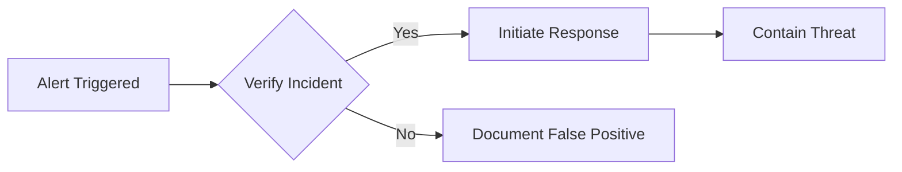

# Security Guide

## Table of Contents

- [Overview](#overview)
- [Security Model](#security-model)
- [Threat Analysis](#threat-analysis)
- [Security Controls](#security-controls)
- [Cryptographic Design](#cryptographic-design)
- [Operational Security](#operational-security)
- [Security Configuration](#security-configuration)
- [Incident Response](#incident-response)
- [Compliance](#compliance)
- [Security Testing](#security-testing)
- [Vulnerability Disclosure](#vulnerability-disclosure)

## Overview

The KSM MCP server is designed with security as the primary concern, implementing defense-in-depth principles to protect sensitive credentials and operations. This document provides comprehensive security guidance for administrators, developers, and security teams.

## Security Model

### Core Principles

1. **Zero Trust Architecture**
   - No component is trusted by default
   - Every operation requires validation
   - Minimal privilege principle applied throughout

2. **Defense in Depth**
   - Multiple security layers
   - Redundant controls
   - Fail-secure defaults

3. **Least Privilege**
   - Minimal permissions required
   - Granular access controls
   - Time-limited sessions

4. **Complete Auditability**
   - Every operation logged
   - Immutable audit trail
   - Forensic capabilities

### Security Boundaries

```
┌─────────────────────────────────────────────────────────┐
│                    System Boundary                       │
│  ┌─────────────┐    ┌─────────────┐    ┌────────────┐  │
│  │  AI Agent   │───►│  MCP Server │───►│ KSM Client │  │
│  │  (Untrusted)│    │  (Trusted)  │    │ (Trusted)  │  │
│  └─────────────┘    └─────────────┘    └────────────┘  │
│         ▲                   │                   │        │
│         │                   ▼                   ▼        │
│         │            ┌─────────────┐    ┌────────────┐  │
│         └────────────│   Storage   │    │  KSM API   │  │
│                      │ (Encrypted) │    │ (External) │  │
│                      └─────────────┘    └────────────┘  │
└─────────────────────────────────────────────────────────┘
```

## Threat Analysis

### Threat Actors

| Actor | Motivation | Capabilities | Likelihood |
|-------|------------|--------------|------------|
| Malicious AI Agent | Credential theft | High (code execution) | High |
| Compromised System | Data exfiltration | Medium (local access) | Medium |
| External Attacker | System compromise | Variable | Low |
| Insider Threat | Data theft/sabotage | High (privileged) | Low |
| Automated Tools | Mass exploitation | Medium (scripted) | Medium |

### Attack Scenarios

#### Scenario 1: Credential Extraction
```
Threat: AI agent attempts to extract KSM credentials
Mitigation: Credentials never exposed, encrypted storage
Detection: Unusual query patterns in audit logs
```

#### Scenario 2: Injection Attack
```
Threat: SQL/Command injection via tool parameters
Mitigation: Comprehensive input validation
Detection: Validation failures logged
```

#### Scenario 3: Privilege Escalation
```
Threat: Bypassing confirmation prompts
Mitigation: Server-side enforcement, timeout
Detection: Unauthorized operation attempts
```

## Security Controls

### 1. Authentication & Authorization

#### Protection Password for Local Profile Encryption
```yaml
security:
  protection_password:
    min_length: 12
    require_complexity: true
    pbkdf2_iterations: 100000
    salt_size: 32
    key_size: 32
```

#### Profile Access Control
- Profile isolation
- No cross-profile access
- Encrypted credential storage
- Time-based access expiry

### 2. Input Validation

#### Validation Layers

1. **Type Validation**
   ```go
   // Example: UID validation
   func ValidateUID(uid string) error {
       if !uidRegex.MatchString(uid) {
           return ErrInvalidUID
       }
       return nil
   }
   ```

2. **Content Validation**
   - Pattern matching
   - Length limits
   - Character whitelisting
   - Encoding normalization

3. **Semantic Validation**
   - Business logic checks
   - Consistency validation
   - Reference integrity

#### Injection Prevention

Protected against:
- SQL Injection: `'; DROP TABLE; --`
- Command Injection: `; rm -rf /`
- Path Traversal: `../../../etc/passwd`
- XSS: `<script>alert('xss')</script>`
- LDAP: `*)(uid=*`
- NoSQL: `{"$ne": null}`
- XML: `<!ENTITY xxe SYSTEM "file:///etc/passwd">`
- Template: `{{.system "id"}}`

### 3. Cryptographic Controls

#### Encryption at Rest
```
Profile Storage:
├─ Master Key: PBKDF2(password, salt, 100000) → 256-bit key
├─ Encryption: AES-256-GCM
├─ Per-Profile Salt: 256-bit random
└─ Additional Data: Profile name for AEAD
```

#### Key Management
- Keys derived, never stored
- Secure key deletion
- No key material in logs
- Hardware security module ready

### 4. Session Security

#### Session Properties
```go
type Session struct {
    ID        string    // UUID v4
    Profile   string    // Active profile
    StartTime time.Time // Session start
    LastUsed  time.Time // Last activity
    IPAddress string    // Client IP
    UserAgent string    // Client identifier
}
```

#### Session Policies
- 15-minute timeout (configurable)
- No session persistence
- Secure session ID generation
- Activity-based renewal

### 5. Rate Limiting

#### Default Limits
```yaml
rate_limits:
  global:
    requests_per_minute: 60
    requests_per_hour: 1000
  per_operation:
    list_secrets: 30/min
    get_secret: 60/min
    create_secret: 10/min
    delete_secret: 5/min
```

#### Implementation
- Token bucket algorithm
- Per-session tracking
- Graceful degradation
- Configurable limits

## Cryptographic Design

### Algorithm Choices

| Purpose | Algorithm | Parameters | Rationale |
|---------|-----------|------------|-----------|
| Encryption | AES-256-GCM | 256-bit key, 96-bit nonce | AEAD, performance |
| Key Derivation | PBKDF2-SHA256 | 100k iterations | NIST approved |
| Random | crypto/rand | System CSPRNG | Cryptographically secure |
| Hashing | SHA-256 | - | Collision resistant |

### Implementation Details

```go
// Encryption example
func Encrypt(plaintext, password []byte) ([]byte, error) {
    // Derive key
    salt := make([]byte, 32)
    crypto.Read(salt)
    key := pbkdf2.Key(password, salt, 100000, 32, sha256.New)
    
    // Create cipher
    block, _ := aes.NewCipher(key)
    gcm, _ := cipher.NewGCM(block)
    
    // Encrypt
    nonce := make([]byte, gcm.NonceSize())
    crypto.Read(nonce)
    ciphertext := gcm.Seal(nil, nonce, plaintext, nil)
    
    return append(salt, append(nonce, ciphertext...)...), nil
}
```

## Operational Security

### Deployment Security

#### Docker Security
```dockerfile
# Run as non-root
USER keeper:keeper

# Read-only filesystem
--read-only

# No new privileges
--security-opt no-new-privileges:true

# Drop capabilities
--cap-drop ALL
```

#### File Permissions
```bash
# Configuration directory
chmod 700 ~/.keeper/ksm-mcp

# Profile storage
chmod 600 ~/.keeper/ksm-mcp/profiles.json

# Audit logs
chmod 600 ~/.keeper/ksm-mcp/logs/audit.log
```

### Monitoring & Alerting

#### Key Metrics
1. Failed authentication attempts
2. Rate limit violations
3. Confirmation rejections
4. Error rates by operation
5. Session duration anomalies

#### Alert Thresholds
```yaml
alerts:
  failed_auth:
    threshold: 5
    window: 5m
    action: notify
  
  rate_limit:
    threshold: 10
    window: 1m
    action: block
  
  error_rate:
    threshold: 20%
    window: 10m
    action: investigate
```

### Backup & Recovery

#### Backup Strategy
1. Profile backups (encrypted)
2. Configuration backups
3. Audit log archives
4. Disaster recovery plan

#### Recovery Procedures
1. Stop all services
2. Restore from backup
3. Verify integrity
4. Update credentials
5. Resume operations

## Security Configuration

### Recommended Settings

```yaml
# config.yaml
security:
  # Protection Password
  enable_protection_password: true
  password_min_length: 16
  
  # Session management
  session_timeout: 15m
  max_sessions: 10
  
  # Confirmation prompts
  require_confirmation: true
  confirmation_timeout: 30s
  
  # Rate limiting
  enable_rate_limiting: true
  rate_limit_burst: 10
  
  # Audit logging
  audit_log_enabled: true
  audit_log_level: info
  audit_log_retention: 90d
  
  # Input validation
  max_input_length: 10000
  validation_strict_mode: true
  
  # Encryption
  encryption_algorithm: "aes-256-gcm"
  key_derivation_iterations: 100000

# Operational settings
operations:
  # Batch mode (no prompts)
  batch_mode: false
  
  # Auto-approval (dangerous!)
  auto_approve: false
  
  # Masking
  mask_by_default: true
  mask_sensitive_fields:
    - password
    - apiKey
    - secret
    - token
    - privateKey
```

### Hardening Checklist

- [ ] Enable protection password for local profile encryption
- [ ] Set strong password policy
- [ ] Configure session timeout
- [ ] Enable rate limiting
- [ ] Set up audit logging
- [ ] Configure log rotation
- [ ] Restrict file permissions
- [ ] Enable confirmation prompts
- [ ] Disable auto-approval
- [ ] Configure field masking
- [ ] Set up monitoring
- [ ] Document procedures

## Incident Response

### Response Plan

#### 1. Detection Phase


#### 2. Containment Actions
1. **Immediate**
   - Stop MCP server
   - Revoke credentials
   - Isolate system

2. **Short-term**
   - Change passwords
   - Review logs
   - Patch vulnerabilities

3. **Long-term**
   - Update procedures
   - Enhance monitoring
   - Security training

#### 3. Investigation Steps
1. Collect evidence
   - Audit logs
   - System logs
   - Network traces
   
2. Timeline analysis
   - Event correlation
   - Root cause analysis
   - Impact assessment

3. Documentation
   - Incident report
   - Lessons learned
   - Remediation plan

### Forensic Capabilities

#### Available Data
- Audit logs (JSON format)
- Session history
- Configuration changes
- Error logs
- System metrics

#### Analysis Tools
```bash
# Search audit logs
jq '.event_type == "unauthorized_access"' audit.log

# Extract timeline
jq -r '[.timestamp, .event_type, .user] | @csv' audit.log

# Find anomalies
grep -E "(failed|error|denied)" audit.log | sort | uniq -c
```

## Compliance

### Framework Mappings

#### NIST Cybersecurity Framework
| Function | Category | Implementation |
|----------|----------|----------------|
| Identify | Asset Management | Profile inventory |
| Protect | Access Control | Authentication, authorization |
| Detect | Anomalies | Audit logging, monitoring |
| Respond | Analysis | Incident response plan |
| Recover | Improvements | Post-incident review |

#### CIS Controls
- Control 1: Inventory (Profile management)
- Control 3: Data Protection (Encryption)
- Control 4: Secure Configuration
- Control 5: Account Management
- Control 6: Access Control
- Control 8: Audit Logs
- Control 12: Network Monitoring

### Compliance Features

#### Data Privacy
- No credential exposure
- Minimal data retention
- Secure deletion
- Access logging

#### Audit Requirements
- Comprehensive logging
- Log integrity
- Retention policies
- Export capabilities

## Security Testing

### Test Categories

#### 1. Unit Tests
```go
func TestSQLInjectionPrevention(t *testing.T) {
    inputs := []string{
        "'; DROP TABLE users; --",
        "1' OR '1'='1",
        "admin'--",
    }
    
    for _, input := range inputs {
        err := validator.Validate(input)
        assert.Error(t, err, "Should reject: %s", input)
    }
}
```

#### 2. Integration Tests
- End-to-end security flows
- Cross-component validation
- Error handling verification

#### 3. Penetration Tests
- OWASP Top 10 coverage
- Custom attack scenarios
- Third-party assessments

### Security Checklist

#### Pre-Release
- [ ] Static analysis clean
- [ ] Dependency scan passed
- [ ] Security tests passed
- [ ] Code review completed
- [ ] Threat model updated
- [ ] Ensure all references to local password use "protection password"

#### Deployment
- [ ] Secure configuration
- [ ] Permissions verified
- [ ] Monitoring enabled
- [ ] Backup tested
- [ ] Incident plan ready

## Vulnerability Disclosure

### Reporting Process

1. **Discovery**: Security issue identified
2. **Report**: Send to security@keepersecurity.com
3. **Triage**: Team evaluates severity
4. **Fix**: Patch developed and tested
5. **Release**: Coordinated disclosure

### Report Format
```
Subject: [SECURITY] Vulnerability in KSM MCP

Description: Clear description of the vulnerability
Impact: Potential impact and severity assessment
Steps to Reproduce: 
1. Step one
2. Step two
3. Expected vs actual behavior

Environment: Version, OS, configuration
Proof of Concept: Code/commands (if applicable)
Remediation: Suggested fixes (optional)
```

### Response Timeline
- **24 hours**: Initial acknowledgment
- **48 hours**: Severity assessment
- **7 days**: Remediation plan
- **30 days**: Target fix release

### Recognition
- Security hall of fame
- Responsible disclosure credit
- Bug bounty program (coming soon)

---

**Security Contact**: security@keepersecurity.com  
**Last Updated**: January 2024  
**Version**: 1.0